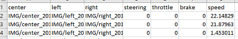
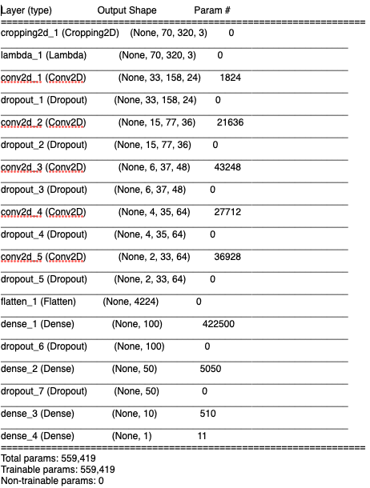
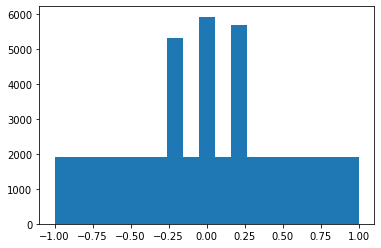
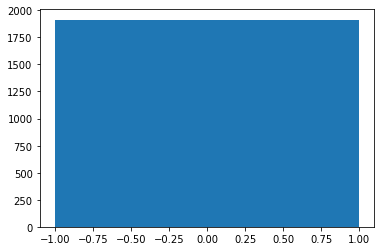

# Behavioral Cloning Project

[](http://www.udacity.com/drive)

Overview
---


In this project, I design, train, and test a convolutional neural network (CNN) to clone the driving behavior from sample images recorded from [Udacity's driving simulator](https://github.com/udacity/self-driving-car-sim). 

The goals / steps of this project are the following: Use the simulator to collect data of good driving behavior Build, a convolution neural network (using Keras) that predicts steering angles from images Train and validate the model with a training and validation set Test that the model successfully drives around the track without leaving the road


### Submission Files

My project submission includes the following files:

* ```model.py``` – the script used to create and train the final model.
* ```model.ipynb``` - the notebook used for development
* ```drive.py``` – the script provided by Udacity that is used to drive the car. I did not modify this script in any way.
* ```model.h5``` – the saved model file. It can be used with Keras to load and compile the model.
* ```report.pdf``` – written report, that you are reading right now. It describes all the important steps done to complete the project.
* ```video.mp4``` – video of the car, driving autonomously on the basic track.

All these files can be found in my project [repository on GitHub]

### Installation & Resources
* Anaconda Python 3.7
* Udacity [Carnd-term1 starter kit](https://github.com/udacity/CarND-Term1-Starter-Kit) with miniconda installation
* Udacity [Car Simulation](https://github.com/udacity/self-driving-car-sim) on MacOC
* Udacity [sample data](https://d17h27t6h515a5.cloudfront.net/topher/2016/December/584f6edd_data/data.zip)

### Quickstart

* Two driving modes:

Training: For user to take control over the car
Autonomous: For car to drive by itself

* Collecting data: User drives on track 1 and collects data by recording the driving experience by toggle ON/OFF the recorder. Data is saved as frame images and a driving log which shows the location of the images, steering angle, throttle, speed, etc. Another option is trying on Udacity data sample.

Approach
---

To have any idea to start this project, the CNN that was eventually used was based on [NVIDIA's End to End Learning for Self-Driving Cars](https://arxiv.org/pdf/1604.07316v1.pdf) paper with different input image size and with dropout added to improve robustness. From the paper, data collection is the first important part. Per project requirement, data collection can only performed on Track 1. I drove about 4 laps around Track 1 by keyboard control to collect data. The driving wasn't extrememly smooth as actual driving. So I decided to use Udacity sample data as starting point.

### Understanding Data
There are 3 cameras on the car which shows left, center and right images for each steering angle.


views_plot



After recording and save data, the simulator saves all the frame images in IMG folder and produces a driving_log.csv file which containts all the information needed for data preparation such as path to images folder, steering angle at each frame, throttle, brake and speed values.

driving_log

In this project, we only need to predict steering angle. So we will ignore throttle, brake and speed information.

### Model Architecture
The model has:

0. Two preprocessing layers, which I will describe later when talking about data.
1. Three convolutional layers with ```(5,5)``` kernels (24, 26 and 48 kernels per layer, correspondingly) with ```(2,2)``` strides, followed by
2. Two convolutional layers with ```(3,3)``` kernels (64 kernels per layer) with ```(1,1)``` strides, followed by
3. Three fully connected layers (with 100, 50 and 10 neurons, correspondingly), followed by
4. Output layer with one output neuron that controls the steering wheel.

I decided to use ELU (Exponential Linear Unit) activation, because [there is evidence](http://image-net.org/challenges/posters/JKU_EN_RGB_Schwarz_poster.pdf) that it can be slightly better than RELU. 




### Training and Validation
In order to train a model, I used two generators – one for training and one for validation. Validation data generator was used to assess out-of-sample performance. Training generator was performing random data augmentation to improve generalization capabilities of the model, but validation generator was only performing preprocessing without doing any of the augmentation. 

When training the model as described in NVIDIA paper, I noticed that training error quickly was becoming smaller than validation error, which is the sign of overfitting. To reduce that I introduced dropout layers after each convolutional and each dense layer with the exception of the output layer. After training the model with different values of dropout I stopped at 0.5 for the final model.


### Data Preprocessing

The secret sauce in making the car drive itself well is not so much the architecture, but the data.

To achieve a more uniform distribution. I tried augment the data, also reduce the occurrence of low and zero angle data points, 
But the training time was too long and the car didn't drive smoothly.




So I didn't augment the data, but remove the data to make it more uniform distributed. Again, the car didn't drive very well due to I dropped off too many data. (Here’s the original distribution of the training data (the x-axis corresponds to steering angles and the y-axis is the data point count for that angle range; Blue bars represent overrepresented classes, removed during data preprocessing step.)


After several try and error, I got a better result by not making the distribution uniformed overall, but make sure it's much closer to uniform for lower and zero turning angles.


### Test Drive

Track 1: 
Click on the image to watch the video or click [here](https://youtu.be/ULiEcbUM2io). You will be redirected to YouTube.

[](https://youtu.be/ULiEcbUM2io)


### Challenges with the Project

Data:
I am not good at playing video games, also my driving skill is very bad. Therefore, it's imposible for me to get the good data from simulator. It was the most difficult challenge for me, getting a smooth driving data. Fortunately, I udacity provide the sample data. Or I will never able to finish the project.

Training time:
I used my local Linux server to train my model, but my GPU was not fast enough. So I could only train the model once or twice per day, which is very frustrated. So I tried Numba, a High Performance Python Compiler, to speed it up and tried not augment the data to reduce the training time.

Data preprocessing
Only very simple data preprocessing steps were taken. It might be beneficial to combine some of the steps that were implemented in the other projects to help, for example, highlight the lane lines more clearly so that the model can use less noisy input data.

I used generators of Keras before, for example ```flow_from_directory()```, but I have never written my own custom generator. For some reason, I thought that it is too difficult and my level of Python was not advanced enough to write my own generators. I was mistaken and realized that generators are not that difficult. This was a really good practice and not only for Keras. Generators are widely used in Python and now I feel more confident in my ability to use and create them.

